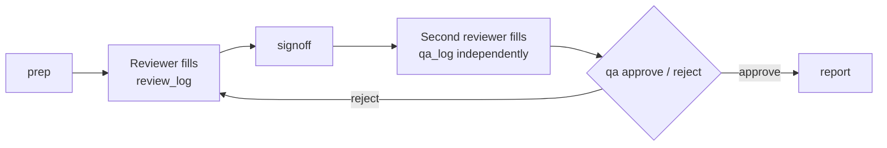

# Audit trail and review QA

Roadmap phase 4. Two tamper-evident trails answer the questions a client, a regulator
or a buyer's due diligence will ask: who handled this evidence, when, what did they
change, and was it checked by a second person?

## 1. Survey evidence (Emergence Review Kit)

Each prep folder holds `audit.jsonl` and `audit.head`. Every command appends an entry:

| Action | Recorded |
| --- | --- |
| `scan` | Card roots, file and recording counts, manifest SHA-256 (in the manifest's folder) |
| `prep` | Recordings, files copied, SHA-256 of `checksums.sha256` and `prep_report.json` |
| `verify` | Files checked, any mismatches |
| `detect` | Detection settings, events per recording, report SHA-256 |
| `review.signoff` | Recording, review log SHA-256, row count, note |
| `review.qa` | Decision, reviewer vs QA reviewer, both log hashes, the comparison figures |
| `report` | Recordings, SHA-256 of every output file |

Each entry records the **actor**: the signed-in Windows account, which on an Entra-joined
laptop is the person's directory identity (`name@company`), plus the machine name.
Setting `EMERGENCE_USER` overrides it for service accounts; the override is recorded,
and the report flags any sign-off or QA made that way.

**How tampering is detected.** Each entry's SHA-256 covers its content and the previous
entry's hash. Editing, deleting, inserting or reordering any line breaks the chain, and
`emergence-kit audit verify <folder>` names the first broken entry. The tools refuse to
add entries to a broken chain, and the report shows the failure at the top instead of
extending it.

**Known limit.** Someone who deletes the last few entries *and* rolls back `audit.head`
leaves a chain that still verifies. Closing that gap needs the head stored somewhere the
user can't edit. The central survey service (phase 6) will do that; until then, `audit
verify` prints the head hash, so record it in the ticket or change record when a survey
is delivered.

### Review workflow



1. The reviewer fills `review_log_<id>.csv`, then runs `emergence-kit signoff <folder> <id>`.
2. A **different person** fills `qa_log_<id>.csv` independently, without looking at the
   first log. Then they run `emergence-kit qa <folder> <id> --decision approve|reject
   --note "..."`. The tool refuses if the QA person is the reviewer, if the review log
   has changed since sign-off, or if there's no sign-off.
3. The comparison matches events of the same type within 2 seconds, and records the
   matched events, those only in the review, those only in QA, the agreement rate and
   the count differences per event type.
4. `report` shows who reviewed and who QA'd each recording. In "Check before use" it
   flags missing sign-offs, logs edited after sign-off, pending or rejected QA, and
   overridden identities.

Whether every recording needs QA, or a sample (say 1 in 10), is the client's policy. The
tools record the facts either way.

`emergence-kit audit export <folder> --out audit.csv` gives the trail as a spreadsheet.

## 2. Knowledge base access (brain API)

Every `/search` and `/document` call appends to `data/audit/<tenant>.jsonl`, chained the
same way, one file per Entra tenant. It records the caller (Entra user or app, or the
shared key), the endpoint, the result or document ids, and a **SHA-256 and length of the
query rather than its text**, because people paste sensitive details into searches.

```bash
python -m brain.audit verify all
```

## ITIL 4 mapping

| Practice | What this provides |
| --- | --- |
| Information security management | Accountability (who), integrity (hash chains), non-repudiation of sign-off |
| Service configuration management | Tool version, settings and file fingerprints behind every output |
| Change enablement | Sign-off and QA act as the approval gate before results are released |
| Continual improvement | QA agreement rates over time show where reviewer training or tools need work |
