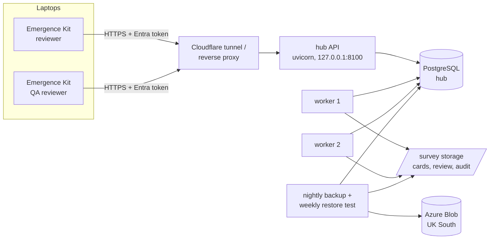

# Survey hub (roadmap phase 6: multi-user)

The Emergence Review Kit works on one laptop. The hub is the central service that lets
a team of reviewers, QA reviewers and servers work on the same surveys safely.

| Need | Without the hub | With the hub |
| --- | --- | --- |
| Two people reviewing the same recording | Nothing stops it; one log overwrites the other | **Lock:** one reviewer per recording, shown to everyone, expires if a laptop goes quiet |
| QA by a different person | Checked on one laptop, by Windows account name | **Enforced centrally** by Entra ID identity, across every laptop |
| Heavy processing (copying, encoding, detection) | On survey laptops, overnight | **Job queue:** runs on the server; laptops only review |
| Audit trail cut short or rebuilt | Undetectable from the folder alone | **Anchors:** the hub holds each entry's hash; `hub verify` shows any difference |
| "Where is survey X up to?" | Ask around | `hub status`: every recording's state, reviewer, QA and locks |
| Several subsidiaries | Separate installs | One hub; each Entra tenant sees only its own surveys |

## Architecture



* **Database:** PostgreSQL 16 on the Debian server (or Azure Database for PostgreSQL
  Flexible Server in UK South). SQLite works for a single-machine trial.
* **Sign-in:** Microsoft Entra ID only (`docs/IDENTITY.md`). Every action belongs to a
  named person with an app role. The shared API key the knowledge base accepts is
  refused here, because it identifies nobody.
* **Tenant isolation:** every row carries the Entra tenant id and every query filters
  on it. A survey in another tenant answers "not found", the same as one that doesn't
  exist.
* **The hub's own audit:** every change (lock, sign-off, QA, job, lock break, reopen) is
  written to a hash-chained log per tenant (`BRAIN_AUDIT_DIR`), the same design as the
  knowledge base's access audit.

## Recording lifecycle and the rules

```
pending --lock--> reviewing --signoff--> signed_off --QA lock--> in QA --approve--> approved
   ^                                                                  |
   +--------------------------- rejected <------------ reject --------+
```

| Rule | Why |
| --- | --- |
| Review needs **Survey.Review**; QA needs **Survey.QA** | Least privilege |
| QA must be a **different person** from the reviewer who signed off (checked when the QA lock is taken *and* at the decision) | A second review by the same person isn't a second opinion |
| QA must be of the **same log** the reviewer signed off (SHA-256 compared) | A log changed after sign-off needs a new sign-off |
| **One lock per recording**, 30 minutes by default and renewable (max 4 hours) | A closed laptop never blocks a recording for long |
| Only **Platform.Admin** can break a lock or reopen an approved recording, always with a written reason | Exceptions are rare, visible and audited |

## Jobs

| Kind | Does | Input | Output |
| --- | --- | --- | --- |
| `scan` | Finds recordings on the cards | `<survey>/cards/` | `<survey>/manifest.json`; registers the recordings |
| `prep` | Local copies with checksums, review copies | the manifest | `<survey>/review/` |
| `detect` | Motion first pass | review copies | `detections_<id>.csv` |

The worker decides every path from the tenant and survey. A job can't name any other
location, and parameters are allow-listed per job kind. Delivery is at least once, with
leases. A worker that crashes loses its lease, and the job goes back to the queue.
Failures retry with back-off (30 s, 60 s, 120 s). After three attempts the job is
**dead**, and it stays visible until someone deals with it. After every job, the worker
anchors the survey folder's audit trail.

The `report` step stays on the laptop on purpose: it needs the survey location for
sunset times, and the hub never stores locations.

## Using it from the Emergence Kit

Once per laptop:

```powershell
winget install Microsoft.AzureCLI;  az login
setx EMERGENCE_HUB_URL   "https://hub.<your-domain>"
setx EMERGENCE_HUB_SCOPE "api://<application-client-id>/access_as_user"
```

Per survey folder:

```powershell
emergence-kit hub link   C:\Review\barn-a --survey barn-a-2026-06-14 --name "Barn A dusk"
emergence-kit hub status C:\Review\barn-a
emergence-kit hub lock   C:\Review\barn-a <recording>          # before you start reviewing
emergence-kit signoff    C:\Review\barn-a <recording>          # goes through the hub
emergence-kit hub lock   C:\Review\barn-a <recording> --qa     # QA person, their laptop
emergence-kit qa         C:\Review\barn-a <recording> --decision approve
emergence-kit hub verify C:\Review\barn-a                      # audit trail vs the hub
emergence-kit hub submit C:\Review\barn-a --job detect         # run on the server
emergence-kit hub jobs   C:\Review\barn-a
```

`signoff` and `qa` need the hub once a folder is linked, because the hub is what stops
two people from signing off. Everything else works offline. Anchoring happens
automatically after commands, and when there's no signal it just happens next time.
Lock tokens are kept per user in `%USERPROFILE%\.emergence-kit\`, never in the shared
folder.

## Install on the Debian server

```bash
sudo bash deploy/hub/setup-postgres.sh                       # database + service user
sudo python3 -m venv /opt/ecomsp/venv
sudo /opt/ecomsp/venv/bin/pip install -r requirements.txt "psycopg[binary]>=3.1"
sudo /opt/ecomsp/venv/bin/pip install -e tools/emergence-kit
sudo install -d -m 0750 -g ecomsp-hub /etc/ecomsp
sudo install -m 0640 -g ecomsp-hub deploy/hub/hub.env.example /etc/ecomsp/hub.env   # then edit
sudo cp deploy/hub/*.service deploy/hub/*.timer /etc/systemd/system/
sudo systemctl daemon-reload
sudo systemctl enable --now ecomsp-hub-api ecomsp-hub-worker@1 ecomsp-hub-worker@2
sudo systemctl enable --now ecomsp-hub-backup.timer ecomsp-hub-restore-test.timer
curl -s http://127.0.0.1:8100/health
```

The database schema is created and upgraded automatically when the API or a worker
starts (numbered migrations, recorded in `schema_migrations`). A hub refuses to run
against a newer schema than it knows.

Publish the API through the existing Cloudflare tunnel (a second hostname pointing at
`http://127.0.0.1:8100`). For strict UK residency of TLS termination, use Azure
Application Gateway in UK South instead (see `docs/compliance/HOSTING-AND-RESIDENCY.md`).

## Operations (ITIL)

| Practice | In the hub |
| --- | --- |
| **Monitoring and event management** | `GET /health`, with no sign-in and no data: database status, schema version, jobs by status and the oldest queued job. Alert when it isn't 200, when `dead` > 0, or when the oldest queued job is over 2 hours old |
| **Incident management** | Dead jobs keep their error; an `anchor.conflict` entry in the hub audit means a folder's trail was altered: treat it as a security incident |
| **Service request management** | Lock breaks and reopens are admin requests with a mandatory reason |
| **Capacity and performance** | Add workers (`ecomsp-hub-worker@3`); queue depth and age in `/health` |
| **Service continuity** | Nightly backup, weekly automated restore test, off-site copy in UK South: `docs/BACKUP.md` |
| **Change enablement** | Numbered schema migrations; CI runs every test on SQLite and PostgreSQL |
| **Information security** | Entra only, roles, tenant isolation, hash-chained audit, localhost bind, systemd hardening |

### Runbook

| Symptom | Action |
| --- | --- |
| "Recording is locked by X" and X is away | Ask X to release it (`hub unlock`). Otherwise wait for the lock to expire (30 min), or an admin runs `POST /surveys/{s}/recordings/{r}/lock/break` with a reason |
| Job `dead` | Read `error` (`hub jobs`). Fix the cause (missing cards, disk full, ffmpeg missing), then queue it again |
| `hub verify` reports "cut short" or "rewritten" | Don't deliver the survey. Preserve the folder. Raise a security incident, and compare against the nightly backup copy of the folder's `audit.jsonl` |
| `/health` 503 | Check `systemctl status postgresql ecomsp-hub-api`, and disk space |
| Workers stuck | `systemctl restart ecomsp-hub-worker@1`. The job goes back to the queue when its lease runs out (5 min) |
