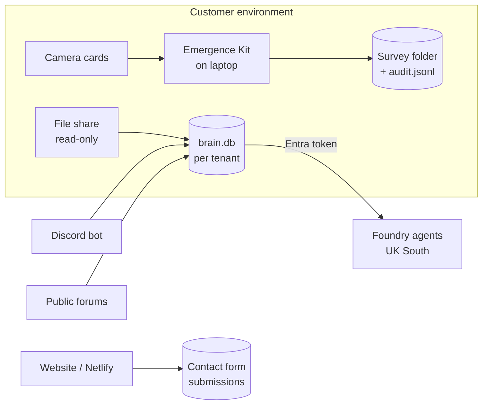

# Data Protection Impact Assessment (draft)

**Status: DRAFT for the controller to complete and sign off.** Not legal advice. Have
it reviewed by your data protection lead or adviser before relying on it. Under UK
GDPR Article 35 a DPIA is required where processing is likely to be high risk. The
systematic recording of staff actions (audit trails) and the archiving of third-party
communications (Discord) are good reasons to do one here, whether or not it's strictly
required.

| | |
| --- | --- |
| System | Ecomsp survey platform: knowledge base ("brain"), Foundry agents, Emergence Review Kit, website |
| Controller | [Legal entity that deploys it: each customer for its own data; us for the website and our own support data] [EDIT] |
| Processor(s) | [Us, when we host or operate the service for a customer] [EDIT] |
| Author / date | [Name], [date] |
| Review | Annually, or when a data source, hosting location or AI provider changes |

## 1. What is processed

| Data | Whose | Where it comes from | Why |
| --- | --- | --- | --- |
| Names, emails, Entra object ids, machine names | Staff using the tools | Entra ID sign-in; Windows account | Access control; audit trail; QA separation of duties |
| Actions taken (who reviewed, QA'd, searched, exported what) | Staff | The tools themselves | Chain of custody for survey evidence; security monitoring |
| Review status, locks, job history, audit hashes (survey hub) | Staff | The hub | Coordinating team review; enforcing QA separation; detecting altered audit trails |
| Discord messages, display names | MSP staff, client staff, community members | Authorised Discord bot, allow-listed servers only | Support knowledge retrieval |
| Survey files, reports, QGIS projects; may contain landowner names, addresses, site locations | Clients, landowners | Client file shares, read-only | Retrieval and video review inside that client's environment |
| NightArc schema and optional free-text notes | Client staff (surveyor names in notes) | Client SQL Server, read-only | Correct SQL for support; searchable survey notes |
| Contact form: name, email, organisation, message | Website visitors | Netlify Forms | Replying to enquiries |
| Public forum posts (usernames) | Forum authors | Stack Exchange API, OSGeo Discourse, GitHub | Support knowledge, attributed |

No special category data is intended. **Risk:** free text such as Discord messages and
report notes can contain health or other personal details. See section 4.

## 2. Lawful basis (to confirm)

| Processing | Proposed basis | Note |
| --- | --- | --- |
| Staff audit trail and access control | Legitimate interests (evidence integrity, security) | Complete a legitimate interests assessment; tell staff in the privacy notice |
| Discord archive | Legitimate interests | Only servers whose admins invited the bot; tell members (channel notice); Discord's Developer Policy applies; no model training |
| Client survey data | Contract with the client (we act as processor) | Data processing agreement per client |
| Contact form | Consent (ticked on the form) plus steps before contract | The website's privacy notice covers it |

## 3. Data flow

## 4. Risks and measures

| Risk | Likelihood / impact | Measures in place | Residual |
| --- | --- | --- | --- |
| Protected-species locations disclosed | Possible / severe | Sensitivity tagging; coordinates never written to outputs; public endpoint serves public sources only; role-based access | Low |
| One subsidiary sees another's data | Unlikely / high | Per-tenant databases; tenant allow-list; tested | Low |
| Personal data in free text shown to people who shouldn't see it | Possible / medium | Entra roles; Discord limited to allow-listed servers; access audit | Medium: consider redacting emails and phone numbers at ingest |
| Excessive retention | Likely without a policy / medium | **Gap:** no automatic deletion yet (deleted source messages stay searchable) | Medium: see actions |
| Erasure request vs tamper-evident audit | Possible / low | Audit entries hold identifiers, not content; deleting one breaks the chain by design | Retain under legitimate interests / legal claims; document the reason; pseudonymise on leaving if policy requires |
| Data sent to an AI provider outside the UK | Possible / medium | Foundry in UK South with regional deployments; see HOSTING-AND-RESIDENCY.md | Low if regional deployments are used |
| Breach of the server | Unlikely / high | Key Vault secrets; fail-closed auth; Cloudflare tunnel with no open inbound ports; patching; Cyber Essentials | Medium until the pen test is done |
| Staff surveillance concerns about audit logs | Possible / low | Logs record work actions on evidence, not activity monitoring; staff notice | Low |

## 5. Actions before go-live

- [ ] Confirm the controller and processor roles, and sign a data processing agreement with each client
- [ ] Legitimate interests assessments: audit trail, Discord archive
- [ ] Retention schedule, for example: audit 7 years or the client contract term; Discord 2 years; contact form 24 months [EDIT]
- [ ] Deletion: honour deleted Discord messages and removed files (code review item 4)
- [ ] Staff privacy notice update; Discord channel notice
- [ ] Netlify: check the DPA and international transfer mechanism for form data
- [ ] Sign-off by: [data protection lead] on [date]
